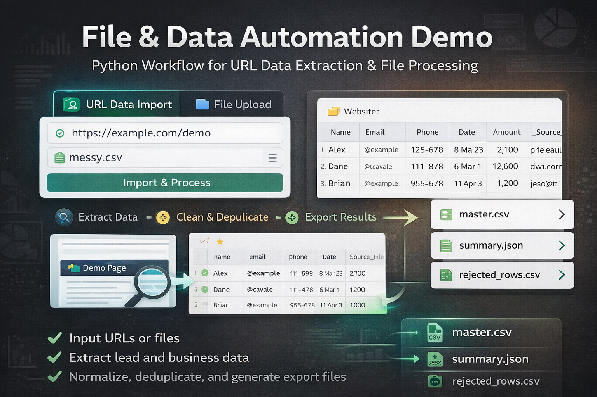

# Python File Automation Demo

A lightweight, config-driven Python automation tool with a simple Streamlit UI for cleaning, merging, deduplicating, and reporting Excel/CSV files in a repeatable workflow.

## Live Demo

**Demo URL:** [Home](https://python-file-automation-demo-production.up.railway.app)

> Upload spreadsheet files, map columns through the UI, run the automation workflow, and download cleaned output files.

<p align="center">
  
</p>

<p align="center">
  Visual overview of the file automation workflow: import, clean, merge, deduplicate, and generate reports.
</p>

## Overview

This project demonstrates a practical Python automation workflow for handling repetitive file-processing tasks through a lightweight user interface. It imports Excel and CSV files, normalizes inconsistent column names, cleans common data issues, removes duplicates, generates summary reports, and archives processed files.

The workflow is designed to be config-driven under the hood, while allowing non-technical users to operate it through a simple UI instead of editing raw JSON files.

## Why This Project Matters

Many businesses receive operational or customer data in multiple spreadsheet files with:

- inconsistent column names
- formatting issues
- duplicate records
- missing required values
- repetitive manual cleanup work

This project shows how Python can automate that process in a reusable and maintainable way, while also making it accessible to non-technical users.

## Key Highlights

- Batch import of CSV and XLSX files
- Simple Streamlit UI for non-technical users
- Column mapping through configurable rules
- Configurable required fields and output columns
- Email, phone, date, and amount normalization
- Duplicate removal using configurable keys
- Summary report generation
- Rejected rows export
- Process logging
- Archive workflow for processed files
- Railway-ready deployment setup

## Demo Features

The live demo allows users to:

- upload CSV or Excel files
- map input columns through a simple UI
- configure required and output fields
- apply cleanup rules for email, phone, date, and amount
- run the automation workflow
- preview cleaned results
- download generated output files

## Demo Notes

- Supported input formats: CSV and XLSX
- The app is designed for demonstration and portfolio purposes
- For production use, workflows can be extended with additional file readers, validation rules, and deployment settings

## Project Structure

```text
python-file-automation-demo/
├─ .streamlit/
│  └─ config.toml
├─ config/
│  ├─ column_mapping.json
│  └─ rules.json
├─ input/
├─ output/
├─ archive/
├─ logs/
├─ samples/
│  └─ screenshots/
│     └─ file-automation-cover.png
├─ src/
│  ├─ main.py
│  ├─ pipeline.py
│  ├─ config_loader.py
│  ├─ reader.py
│  ├─ cleaner.py
│  ├─ merger.py
│  ├─ reporter.py
│  └─ utils.py
├─ tests/
├─ app.py
├─ railway.json
├─ requirements.txt
└─ README.md
```

## How It Works

The workflow follows these steps:

1. Upload or read supported files
2. Normalize incoming column names based on mapping rules
3. Validate required fields
4. Clean selected columns
5. Merge all records into a single dataset
6. Remove duplicates using configured keys
7. Export clean output files
8. Write logs and summary reports
9. Archive processed files

## Supported File Types

- `.csv`
- `.xlsx`

## UI-First, Config-Driven Design

This project uses a simple UI for user interaction, while keeping processing rules configurable in the background.

This means:

- non-technical users can operate the workflow through the interface
- schema and rule changes remain maintainable
- many future updates can still be handled without rewriting the whole pipeline

## Configuration-Driven Design

The project uses structured configuration for maintainability.

### `config/column_mapping.json`

Used to map multiple source column names into standard internal names.

Example:

```json
{
  "name": ["name", "full_name", "customer_name", "client_name"],
  "email": ["email", "email_address", "e_mail", "e-mail", "customer_email"],
  "phone": ["phone", "phone_number", "mobile", "mobile_number", "tel", "telephone"],
  "date": ["date", "created_at", "signup_date", "registration_date"],
  "amount": ["amount", "total_amount", "price", "order_amount", "payment_amount", "invoice_amount"]
}
```

### `config/rules.json`

Used to control validation and processing rules.

Example:

```json
{
  "required_columns": ["name", "email", "phone", "date"],
  "output_columns": ["name", "email", "phone", "date", "amount", "_source_file"],
  "drop_columns": [],
  "dedupe_keys_primary": ["email"],
  "dedupe_keys_fallback": ["name", "phone"],
  "cleaning_rules": {
    "trim_whitespace": ["name"],
    "lowercase": ["email"],
    "digits_only": ["phone"],
    "amount_decimal": ["amount"],
    "date_format": {
      "date": "%Y-%m-%d"
    }
  }
}
```

## Why Config Matters

Instead of hardcoding every column rule inside Python logic, this project allows many changes to be handled through configuration or UI updates.

Examples of changes that can often be handled without rewriting the main workflow:

- renaming columns
- adding new column aliases
- changing required fields
- changing deduplication keys
- changing output column order
- dropping unnecessary columns

## Amount Normalization Rule

This project includes an extensible field transformation example for financial values through the `amount_decimal` rule.

In many real business files, amount-related fields may appear in inconsistent formats such as:

- `1000`
- `1,000`
- `$1,000`
- `NT$ 1,000.5`
- `(1,200.75)`

The workflow can normalize these values into a consistent decimal format, for example:

- `1000.00`
- `1000.00`
- `1000.00`
- `1000.50`
- `-1200.75`

This makes the automation more practical for client-facing use cases where spreadsheet exports often contain currency symbols, separators, or accounting-style negative values.

### Why This Matters

This rule demonstrates that the workflow is not limited to column mapping and basic cleanup only. It can also be extended with custom Python-based transformation rules for fields that require business-oriented normalization.

That makes the project closer to a real deliverable automation solution:

- schema changes can be handled through config
- custom transformation logic can be added through reusable Python rules

### Example Configuration

In `config/rules.json`:

```json
{
  "cleaning_rules": {
    "amount_decimal": ["amount"]
  }
}
```

In `config/column_mapping.json`, multiple source columns can be mapped to the standard `amount` field, such as:

- `amount`
- `total_amount`
- `price`
- `order_amount`
- `payment_amount`
- `invoice_amount`

### Business Value

This design reflects a more realistic automation workflow for operational or finance-related spreadsheets, where both structural flexibility and field-level normalization are important.

Instead of building a one-off script for a single file format, the project demonstrates how to support evolving input schemas while keeping the processing logic maintainable and extensible.

## Installation

### 1. Clone the repository

```bash
git clone https://github.com/your-username/python-file-automation-demo.git
cd python-file-automation-demo
```

### 2. Create and activate a virtual environment

#### Windows

```bash
python -m venv .venv
.venv\Scripts\activate
```

#### macOS / Linux

```bash
python3 -m venv .venv
source .venv/bin/activate
```

### 3. Install dependencies

```bash
pip install -r requirements.txt
```

## Run Locally

### Streamlit UI

```bash
streamlit run app.py
```

### CLI Mode

```bash
python src/main.py
```

## Railway Deployment

This project includes Railway-ready deployment files.

### Included deployment files

- `railway.json`
- `.streamlit/config.toml`

### Start command

The deployed app runs with:

```bash
streamlit run app.py --server.address 0.0.0.0 --server.port $PORT
```

### Deployment flow

1. Push the repository to GitHub
2. Create a new Railway project
3. Choose **Deploy from GitHub repo**
4. Select this repository
5. Wait for build and deployment
6. Generate a public Railway domain

## Example Output

After execution, the project can generate files such as:

- `output/master.csv`
- `output/summary.json`
- `output/rejected_rows.csv`
- `logs/process.log`

### Example `summary.json`

```json
{
  "files_processed": 3,
  "rows_read": 120,
  "rows_after_cleaning": 108,
  "duplicates_removed": 9,
  "invalid_rows": 3,
  "output_file": "output/master.csv"
}
```

## Example Use Case

Imagine a team receives multiple files from different sources:

- one file uses `Email`
- another uses `email_address`
- another uses `E-mail`
- another includes `price` instead of `amount`

Some rows contain:

- uppercase emails
- phone numbers with symbols
- inconsistent date formats
- duplicate contacts
- currency-formatted numeric values

This tool standardizes and cleans all of that automatically, then exports one clean master dataset and a summary report.

## Before vs After

### Before

- Multiple messy Excel/CSV files
- Different column names for the same data
- Duplicate records
- Inconsistent formatting
- Manual repetitive cleanup

### After

- One clean merged file
- Standardized columns
- Normalized values
- Duplicate records removed
- Summary report generated
- Process log saved
- Input files archived

## Testing

Run tests with:

```bash
pytest -q
```

## Screenshots

### Cover / Workflow Overview


## Portfolio Positioning

This project is suitable for showcasing skills in:

- Python automation
- Excel/CSV processing
- File workflow automation
- Data cleanup automation
- Reporting automation
- Configurable scripting
- Lightweight UI development
- Deployment-ready demo packaging

## Business Value

This project is designed to demonstrate how Python can reduce repetitive manual work in business operations.

It is not just a one-off script. It shows how to build a reusable automation workflow that remains maintainable when file schemas evolve over time.

This project demonstrates both config-driven schema handling and extensible field transformation rules, making it suitable for automation scenarios where input files change over time and certain fields require standardized business formatting.

It also shows how a technical workflow can be wrapped in a simple user interface so that non-technical users can operate it more confidently.

## Possible Future Improvements

- additional file readers such as TSV, XLS, and JSON
- user-defined saved mapping templates
- Excel formatting for final reports
- email notification after processing
- scheduled execution
- multi-user support
- Docker packaging
- API trigger support
- role-based workflow presets

## Tech Stack

- Python
- Streamlit
- pandas
- openpyxl
- pathlib
- logging
- JSON configuration
- Railway deployment

## License

This project is provided for demonstration and portfolio purposes.
